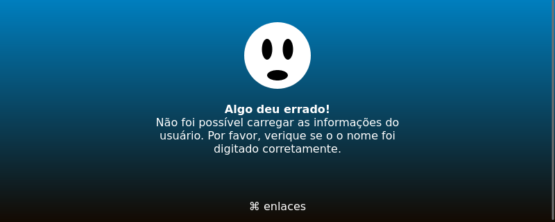

arvore-de-enlaces
=================

Árvore de enlaces é uma tentativa de copiar a página de perfis do
linktree a partir do zero e usando somente HTML, CSS e JS básicos. Ele
funciona com um exercício de HTML com CSS (não foi usada classe alguma
aqui, apenas a redefinição dos elementos). E também serve como exemplo
sobre como fazer as coisas somente com JS puro.

Como rodar?
-----------

Abra o arquivo `index.html` diretamente no navegador _web_ ou então
execute um servidor HTTP de desenvolvimento dentro do diretório `src`
do projeto. Como, por exemplo, o servidor HTTP disponível na biblioteca
padrão do Python:

```
$ cd arvore-de-enlaces/src
$ python -m http.server
Serving HTTP on 0.0.0.0 port 8000 (http://0.0.0.0:8000/) ...
```

Para sair, pressione **«Ctrl»+«C»**.

Como usar?
----------

Para acessar um determinado perfil, adicione-o ao final da URL, por
exemplo, o usuário **dummy** através da URL `http://127.0.0.1:8000/?dummy`
e que retornará.


Caso o usuário não exista ou ocorra um erro no carregamento do
perfil será retornada uma página de erro.



Este exemplo é minimamente funcional, basta acrescentar novos perfis
como arqiovos JSON dentro de `./assets/data/people`. Ou entã conectar
sua própria API REST aqui.

Estrutura do perfil
-------------------

O arquivo que o programa lê é um JSON com seguinte estrutura:

``` json
{
  "name": "nome do usuário",
  "description": "breve descrição sobre o mesmo",
  "avatarUrl": "URL do avatar",
  "links": [
    {
      "name": "Descrição do linl",
      "url": "URL que ele aponta"
    }
  ]
}
```

Finalizando
-----------
Antes de finalizar, alguns pontos:

- O desenho da página é responsivo e ela se adapta automaticamente em
  telas de tamanho pequeno.
- Há suporte rudimentar para localização das mensagens e este se
  configura a partir do idioma padrão do navegador.
- Aq janela modal para compartilhar a página não foi implementada.
- Pensei em fazer um tema escuro mas fiquei com preguiça... :-)

E, claro, contribuições são bem vindas.

Boa diversão!